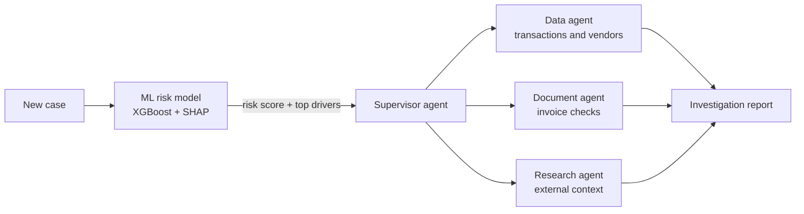

# 🔍 Argus — Multi-Agent Risk Investigation Platform

**🚧 In progress.** Argus combines a classical ML risk model with specialist AI agents: the model flags suspicious cases, and the agents investigate and explain them in plain English.

> Named after Argus Panoptes, the hundred-eyed watchman of Greek mythology.

---

## Why this project

Risk teams face two problems at once:

- **Too many cases to review manually** — so they need fast, reliable scoring.
- **Scores alone don't explain anything** — so an analyst still has to dig through data and documents to understand *why* a case is risky.

Argus is built around a simple principle: **use classical ML where you need speed, accuracy and auditability, and use LLM agents where you need investigation and explanation.**

---

## How it works



1. **Score** — an XGBoost model scores each case for risk.
2. **Explain** — SHAP shows which factors drove the score.
3. **Investigate** — a supervisor agent delegates to specialist agents, which use tools (via MCP) to pull data and check documents.
4. **Report** — findings are combined into a clear investigation summary for a human analyst to decide on.

---

## Status

| Stage | Status |
|---|---|
| Data exploration (`explore.py`) | ✅ Done |
| ML risk model training (`train.py`) | ✅ Done |
| Model explainability with SHAP | 🔄 In progress |
| FastAPI scoring service | ⬜ Planned |
| Specialist agents (LangGraph) | ⬜ Planned |
| MCP tool integration | ⬜ Planned |
| Deployment + monitoring | ⬜ Planned |

---

## Design choices

- **Class imbalance is central** — risky cases are rare, so the model is evaluated on precision and recall, not plain accuracy.
- **Explainability first** — every score comes with its top drivers, so decisions are auditable.
- **Human in the loop** — agents recommend; a human analyst makes the final call.

---

## Tech stack

**ML:** Python · Pandas · scikit-learn · XGBoost · SHAP

**Agents (planned):** LangGraph · MCP · FastAPI

---

## Repo structure

```
argus-risk-engine/
├── explore.py   # exploratory data analysis
├── train.py     # risk model training and evaluation
└── README.md
```
